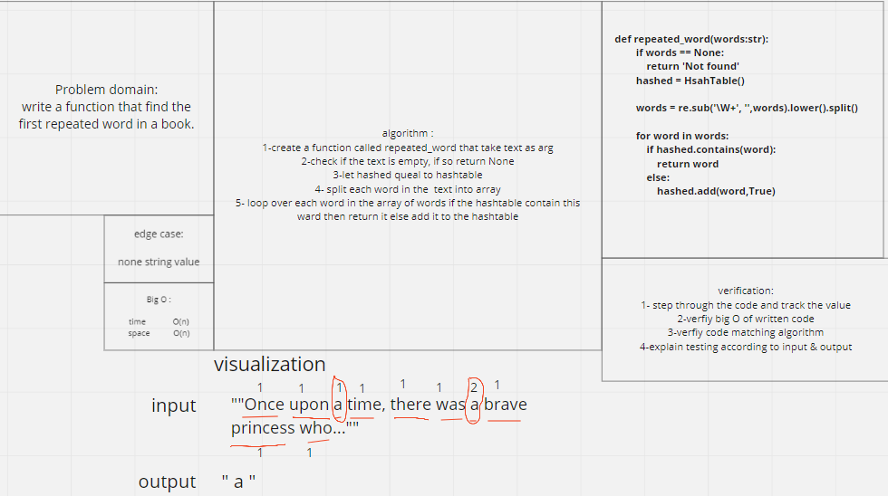

## Challenge

**Write a function called repeated word that finds the first word to occur more than once in a string**

## Approach & Efficiency:

1- function called repeated word that finds the first word to occur more than once in a string

2- declare hashed = Hashetable()

3- let all string in the words as array and remove the links

4- loop over the words and check if the hashed contain the word. if so, return the word. if not added to hashtable

## Big O :

Time--> O(n)
space--> O(n)

## whiteboard

