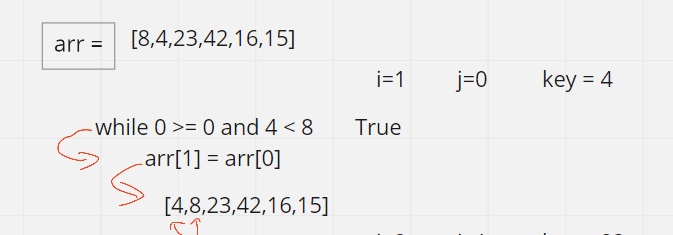
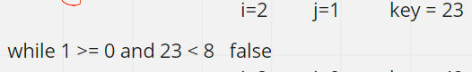
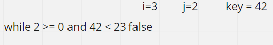
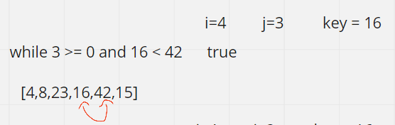
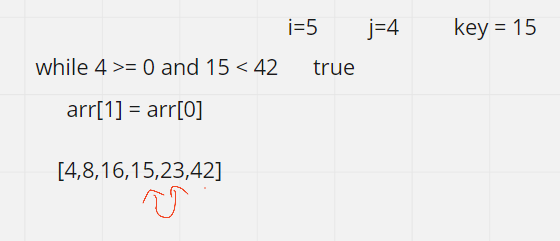

## Insertion Sort:
**The array is virtually split into a sorted and an unsorted part. Values from the unsorted part are picked and placed at the correct position in the sorted part.**

--------------------------------

i = 1

i = 2

i = 3

i = 4

i = 5

