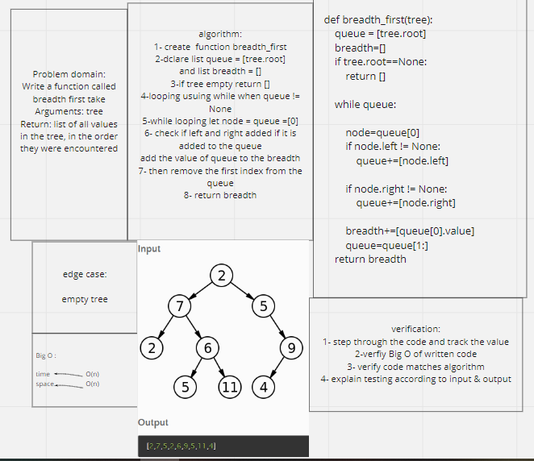

## Trees

### Binary Tree Problem domain:

Create a Binary Tree class
Define a method for each of the depth first traversals:
pre order
in order
post order which returns an array of the values, ordered appropriately.

### Binary Search Tree Problem domain:

Create a Binary Search Tree class
This class should be a sub-class (or your languages equivalent) of the Binary Tree Class, with the following additional methods:

Add
Arguments: value

Return: nothing

Adds a new node with that value in the correct location in the binary search tree.

Contains
Argument: value

Returns: boolean indicating whether or not the value is in the tree at least once.

------------------------------------------------------

## breadth_first white board:

## PR Link: https://github.com/Mahmoud-Dinah/data-structures-and-algorithms/pull/33

------------------------------------------------------

# Tree Fizz Buzz:

1[treeFizzBuzz](tree_fizz_buzz.PNG)

## PR Link: https://github.com/Mahmoud-Dinah/data-structures-and-algorithms/pull/35
---------------------------------

resource:

- https://www.geeksforgeeks.org/find-maximum-or-minimum-in-binary-tree/
