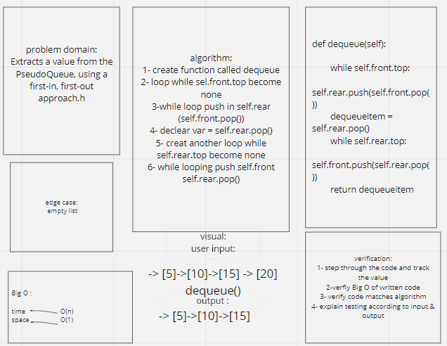

# Challenge Summary:

  Create a new class called pseudo queue.

Do not use an existing Queue.

Instead, this PseudoQueue class will implement our standard queue interface (the two methods listed below),
Internally, utilize 2 Stack instances to create and manage the queue

## PR Link : https://github.com/Mahmoud-Dinah/data-structures-and-algorithms/pull/25
----------------------------------------------

## enqueue:

------------------------------------------------------

## dequeue:

------------------------------------------------------
